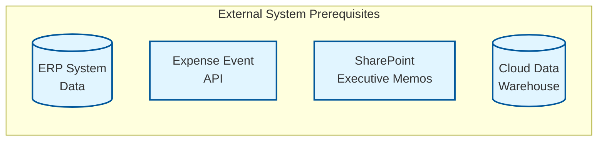
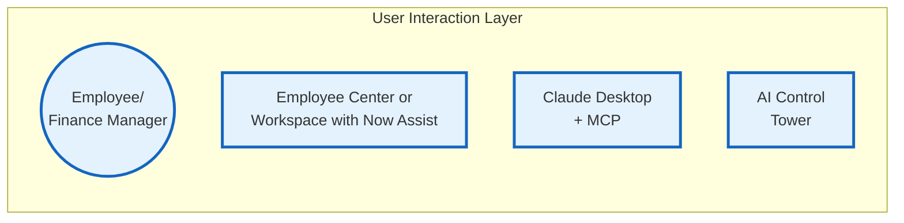
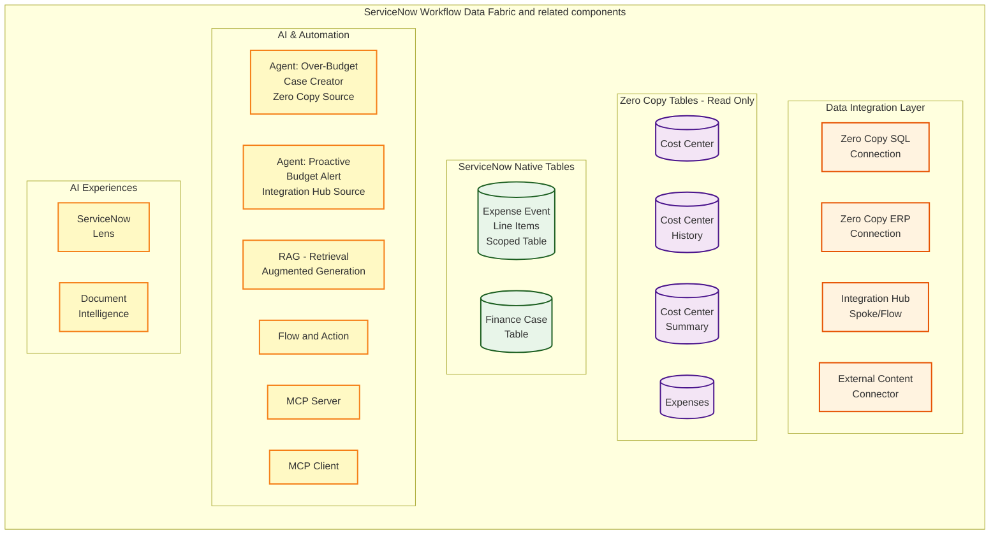
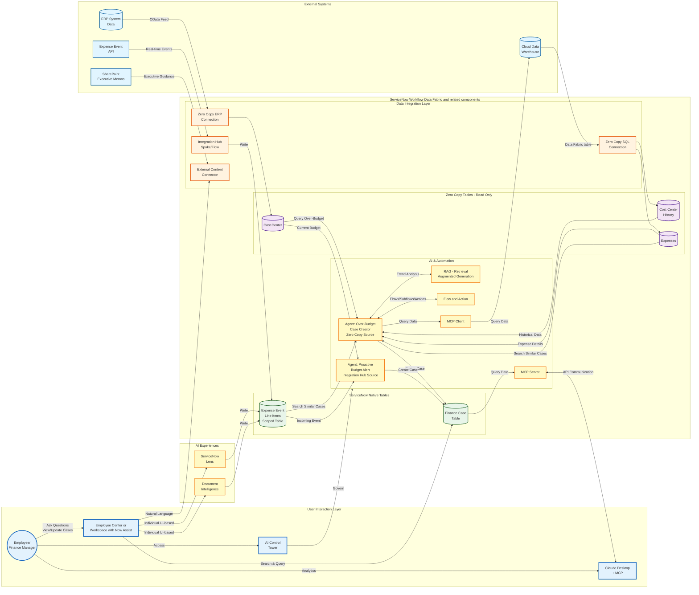

# Data and Flow Diagrams

[Take me back to main page](./)

## Components

Let us first start by breaking down the different components of the lab. In a tightly integrated ServiceNow landscape that spans various internal ServiceNow components and external data sources, the diagram below would be a good represenation. These internal and external components will be used by Flows and AI Agents to provide the automations needed to solve our business problem of managing financial budgets. While the components will look overwhelming, the reality is customer landscapes require this level of complexity to manage different types of data across multiple functions. The key thing to note is the end user will interact with **Employee Center**, an **MCP Client** (e.g., Claude Code or Desktop), or in slightly more technical scenarios **AI Control Tower**.

### External system prerequisites

Baseline configuration for the external systems listed in this lab are done prior to the steps listed. As mentioned in the disclaimer, environments which will have the prereqiusite external systems will be available externally for customers soon and for time being, you can use this lab as a guide on how the components will interact.

* **ERP**: This lab will use an SAP system with either BAPI/RFC or OData endpoints. The authentication and integration is already configured in this exercise and the objective is get the needed data by selecting the ERP data model and extraction table. If you wish to learn more on how to create the configuration in your own environment, check this [Zero Copy Connector for ERP guide by Leo Francia in the ServiceNow community](https://www.servicenow.com/community/app-engine-for-erp-blogs/part-1-of-4-intelligent-erp-workflows-get-sap-data-into/ba-p/3192800). You can also take this ServiceNow University course on [Introduction to Zero Copy Connector for ERP Data Products and Process Extensions](https://learning.servicenow.com/lxp/en/app-engine/introduction-to-zero-copy-connector-for-erp-data-products-and?id=learning_course_prev\&course_id=72e3387d937bea54fb94b4886cba1095).
* **Cloud Data Warehouse**: Snowflake will be the cloud data warehouse used in this lab. If you have a Databricks or Redshift environment, the principles and steps here will also apply. The Snowflake key-pair authentication and integration is already configured in this execrcise and the objective is get the needed data asset by selecting it from Workflow Data Fabric Hub. If you wish to learn more on how to create the configuration in your own environment, check this ServiceNow University course on [Zero Copy Connector Basics](https://learning.servicenow.com/lxp/en/automation-engine/zero-copy-connector-basics?id=learning_course_prev\&course_id=c505959493283e903cc0322d6cba1025).
* **Document Storage**: SharePoint will be used as the document storage which will be the target of External Content Connectors or XCC. Unstructured data will be stored in SharePoint which will be indexed by ServiceNow as additional source of data for Flows and AI Agents in this lab exercise. If you wish to learn more on how to create the configuration in your own environment, check this ServiceNow University course on [Introduction to AI Search and External Content Connectors](https://learning.servicenow.com/lxp/en/now-platform/introduction-to-ai-search-and-external-content-connectors?id=learning_course_prev\&course_id=62283c7c93d46e50f2d9bc686cba107b).
* **Expense Event API**: This component can be created as a mock endpoint using services such as [beeceptor.com](beeceptor.com). The specification for the API will be provided in this lab so you can simulate it in your own environment.

### User interaction layer

The end user will interact with **Employee Center**, an **MCP Client** (e.g., Claude Code or Desktop), or in slightly more technical scenarios **AI Control Tower**. These three interfaces will be end test scenario for the lab exercises.

### ServiceNow Workflow Data Fabric

The next diagram shows the various ServiceNow components that interact with the external systems while working in the back-end to provide the data and automation needed by users.

#### Data Integration Layer and Zero Copy Tables

These data integrations match the external sources mentioned earlier.

* **Zero Copy Connector for SQL**: also known as ZCC for SQL will connect to the Snowflake data assets for the lab, specifically the Cost Center History, Expenses, and Summary.
* **Zero Copy Connector for ERP**: also known as ZCC for ERP will get the cost center master data from SAP.
* **Integration Hub**: will access the REST API data, for the lab it will be a periodic trigger.
* **External Content Connector**: will access the indexed documents in SharePoint to enrich decision making and automations for our finance workflow.

#### Zero Copy Tables

These are pointers to the respective tables coming from either the Cloud Data Warehouse (Snowflake) or ERP (SAP).

* **Cost Center**: master data taken from the ERP system, known as CSKS from SAP but can also be obtained with through BAPI or OData endpoints. Master data does not change frequently in ERP systems so either persistence or zero copy approaches are viable for ServiceNow use cases.
* **Cost Center History**: monthly data taken from the Cloud Data Warehouse with information whether cost centers have historically gone over/under budget or on target. ERP systems normally do not store this type of history or aggregation and is hence stored in a business or data warehouse.
* **Cost Center Summary**: aggregated Cost Center History data for the year stored in the Cloud Data Warehouse for reporting purposes.&#x20;
* **Expense History**: this can come from an expense management system, ERP system, or Cloud Data Warehouse. For this lab, we are obtaining this from the Cloud Data Warehouse.

#### ServiceNow Native Tables

These are local tables and are not persisted in any other systems.

* **Expense Event Table:** is a scoped table will obtain expense events via Rest API from expense sources such as cloud infrastructure services or even document capture via ServiceNow Lens and Document Intelligence.
* **Finance Case Table**: is a standard table in ServiceNow Finance case management (**sn\_spend\_sdc\_service\_request**) where the Flows and Agents will perform updates based on the expense events ingested either in the background or interactively.

#### AI & Automation

* **Flow and Action:** a scoped Flow and a scoped Action are used to get expense data from a REST API source.
* **MCP Server and Client:** MCP or Model Context Protocol is an open standard that lets AI models (LLMs) securely connect to and use external data, tools, and services, acting like a universal adapter to give real-world context beyond their training data for better decision-making and task execution. This will allow Now Assist from ServiceNow act as a data source for clients such as Claude Desktop or act as a client when connecting to MCP-based services (e.g. Snowflake or Notion) feeding data into Flows or Agents.
* **RAG - Retrieval Augmented Generation:** Now Assist uses AI Search to retrieve relevant information from your knowledge bases, documentation, and records before generating a response. Rather than relying solely on what the LLM was trained on, it grounds answers in your actual ServiceNow local and integrated data. Think of it as having someone who does the research first, then answers, except it happens in seconds.
* **Agent: Proactive Budget Alert Integration Hub Source:** contains RAG and Flows to assess cost center budget history, transactions, and status to create the appropriate Finance Case so budgets can be handled proactively. This is triggered by the Flow and Action that gets Expense Transaction Events from an external REST API source.
* **Agent: Over-Budget Case Creator Zero Copy Source**: similar to **Agent: Proactive Budget Alert Integration Hub Source** but does not have a trigger. This agent is created separately to create a lab exercise that focuses on Zero Copy but is similar to **Agent: Proactive Budget Alert Integration Hub Source** with the only difference being the trigger configuration.

#### AI Experiences

While not part of Workflow Data Fabric, these provide additional data sources for the Flows and AI Agents to use.

* **ServiceNow Lens:** an AI-powered feature that uses generative AI to scan, extract, and understand data from on-screen sources like screenshots, emails, or log files, even outside ServiceNow. This can be useful to get Expense Transaction Events coming from receipts which are scanned interactively (i.e. through ServiceNow app or in a browser window).
* **Document Intelligence:** an AI-powered solution that uses machine learning, natural language processing (NLP), and computer vision to automatically extract, classify, and process data from various digital and scanned documents, useful for processing Expense Transaction Events coming from multiple documents.

## Overall data flow

Do not let the chart intimidate you 😉. This will be broken down further and the intent of showing the whole data flow is to provide an overview of the inner workings within ServiceNow while, as mentioned earlier, the end user will interact with **Employee Center**, an **MCP Client** (e.g., Claude Code or Desktop), or in slightly more technical scenarios **AI Control Tower**.

You can skip the review of the diagram below if you prefer, and head straight into the lab exercises, each of which having its individual (and much more broken down 😉) data flow.

* [Lab Exercise: Fundamentals](1_Fundamentals.md)
* [Lab Exercise: Integration Hub](2_Integration_Hub.md)
* [Lab Exercise: Zero Copy Connectors](3_Zero_Copy.md)
* [Lab Exercise: External Content Connector](4_External_Content_Connector.md)
* [Lab Exercise: ServiceNow Lens and Document Intelligence](5_Lens_and_DocIntel.md)
* [Lab Exercise: Model Context Protocol Server/Client and AI Control Tower](6_MCP_and_AI_Control_Tower.md)

[Take me back to main page](./)
