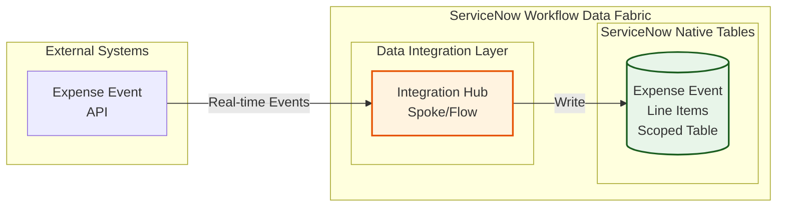

# Lab Exercise: Fundamentals
[Take me back to ReadMe](https://github.com/leojacinto/WorkflowDataFabric/blob/main/ReadMe.md)

This lab will walk you through creation of the scoped tables needed to interact with the external system integrations.
### Data Flow
The data flow below shows how ServiceNow will consume REST API endpoints via Integration Hub Spokes then further processed by a Flow so the entries will be written in the scoped table.

### Lab Story So Far
While you have the power of CMDB at your fingertips, there are processes which require specific steps and data formats. You will need to create a scoped table which will store information from an expense event API.

### Steps
 1. Go to the top right portion of your navigation and click on the a.) globe icon then the b.) list icon to change the scope.
 
 2. In the succeeding screen, click "New."
 
 4. Go to section "Start from Scratch" and click "Create"
 
 5. Provide the scope details with a.) name and the b.) scope. Click c.) Create. Note that the scope is a technical name and is automatically populated but you have the option to change it. In this example, the scope is x_snc_forecast_var. Throughout the exercise, you will notice in screenshots that the scope name used is x_snc_forecast_v_0.
 
 6. Navigate to a.) System Definition > b.) Tables

 7. dd
 8. d
 9. d
 10. d
 11. d
 12. d
 13. d
 14. d
 15. d
 16. d
 17. d
 18. d
 

[Take me back to ReadMe](https://github.com/leojacinto/WorkflowDataFabric/blob/main/ReadMe.md)
