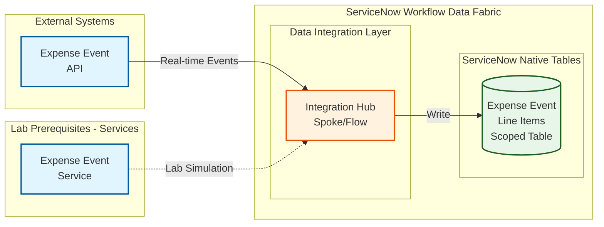

# Lab Exercise: Fundamentals
This lab will walk you through creation of the scoped tables needed to interact with the external system integrations.
### Data Flow
The data flow below shows how ServiceNow will consume REST API endpoints via Integration Hub Spokes then further processed by a Flow so the entries will be written in the scoped table.

