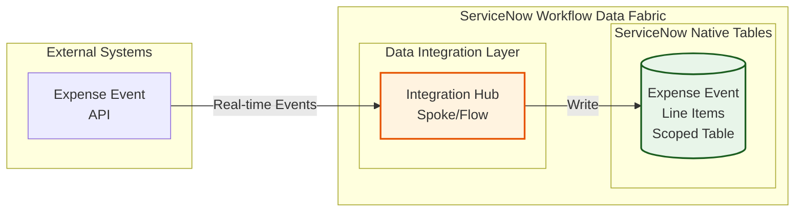

# Lab Exercise: Fundamentals

[Take me back to ReadMe](./)

This lab will walk you through creation of the scoped tables needed to interact with the external system integrations.

## Data flow

The data flow below shows how ServiceNow will consume REST API endpoints via Integration Hub Spokes then further processed by a Flow so the entries will be written in the scoped table.

## Lab story so far

While you have the power of CMDB at your fingertips, there are processes which require specific steps and data formats. You will need to create a scoped table which will store information from an expense event API.

## Steps

1. Go to the top right portion of your navigation and click on the a.) globe icon then the b.) list icon to change the scope.

<figure><figcaption></figcaption></figure>

2.  In the succeeding screen, click **New**.&#x20;

    <figure><figcaption></figcaption></figure>
3.  Go to section **Start from Scratch** and click **Create**&#x20;

    <figure><figcaption></figcaption></figure>
4.  Provide the scope details with a.) name and the b.) scope. Click c.) Create. Note that the scope is a technical name and is automatically populated but you have the option to change it. In this example, the scope is **x\_snc\_forecast\_var**. Throughout the exercise, you will notice in screenshots that the scope name used is **x\_snc\_forecast\_v\_0**.&#x20;

    <figure><figcaption></figcaption></figure>
5.  Verify that you are in the correct scope after you have created it. Being in the correct scope as you proceed with the lab will avoid scope access and object management isues.&#x20;

    <figure><figcaption></figcaption></figure>
6.  Now that you are in the right scope, you are ready to create the scoped table. Navigate to All > a.) type **System Definition** > b.) search for **Tables**&#x20;

    <figure><figcaption></figcaption></figure>
7.  Go to the top right section of the navigation and click **New**.&#x20;

    <figure><figcaption></figcaption></figure>
8.  Provide the a.) **Label** as **Expense Transaction Event**. The b.) **Name** which is a technical identifier will automatically be populated and can be modified to suit your requirement. Finally, untick c.) **Create module**.&#x20;

    <figure><figcaption></figcaption></figure>
9.  Right click on the header and click **Save**.&#x20;

    <figure><figcaption></figcaption></figure>
10. Staying in the same screen, an option to create fields for the table will be available. In the tab **Columns** click on **New**.&#x20;

    <figure><figcaption></figcaption></figure>
11. Let us use one column as an example. Provide the a.) **Type**, in this case **String**. Provide the b.) **Column label**, in this example, **Cost Center** which will automatically populate the c.) **Column name**. Since this is the string, provide the d.) **Max length** of **40**. Finally, right click on then header and e.) **Save**.&#x20;

    <figure><figcaption></figcaption></figure>
12. Do the same steps for all of the 16 other fields below. Note that the **Column label**, **Column name**, **Type**, **Max length** vary across some columns. For now, keep **Display** as **false** across all fields.&#x20;

    <figure><figcaption></figcaption></figure>

## Conclusion

Congratulations! You have create the destination table within ServiceNow for the external REST API sources.

## Next step

Let us continue building the data foundations for the use case. Next up is creation of the Data Fabric tables which will be used by AI Agents. Click [here to proceed with configuring the Data Fabric tables using ServiceNow's Zero Copy cpability](/broken/pages/qvtWnBJJ7yRVnf7LkGP6).

Alternatively, you can focus purely on REST API conectivity by proceeding with the [Integration Hub configuation](/broken/pages/Mxtr8y5z9iSBqS1mCbau).

[Take me back to ReadMe](./)
