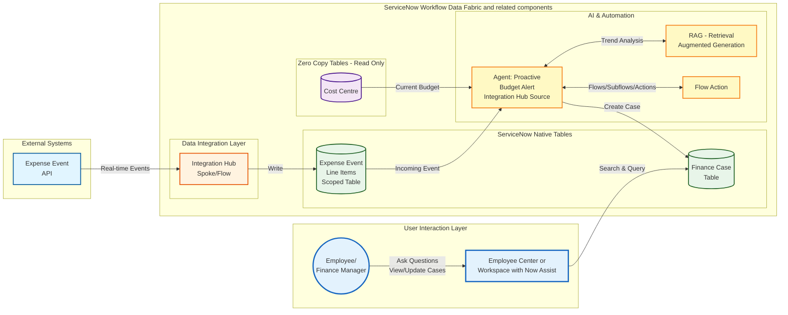

# Lab Exercise: Integration Hub

[Take me back to main page](./)

This lab will walk you through the configuration and usage of Spoke actions and Flows to get expense data from an external source periodically or ad hoc and trigger an agent which will evaluate the expense data and create a Finance case if the involved cost center will be over budget.

There are dedicated Integration Hub and Flow Designer labs so the focus of this exercise is to walk through the configurations in AI Agent Studio and Flow Designer. There is a final exercise at the very end for you to create a Spoke action to provide an understanding on how the AI Agents are triggered.

## Data flow

The data flow below shows how ServiceNow will consume REST API endpoints via Integration Hub Spokes then further processed by a Flow so the entries will be written in the scoped table.

## Steps

### Walkthrough of Custom Forecast Variance AI Agent

This is a walk through of how the an AI Agent with equipped with both deterministic and probabilistic can automate research and validation of cost center history and expenses as well as creation of Finance Cases should cost centers be above their budget allocations. <mark style="color:red;">**Note:**</mark> this is a custom AI agent pre-configured in the lab instance provided in ServiceNow-led lab sessions; this is not a pre-built agent.

1. Go to All > type **x\_snc\_forecast\_v\_0\_expense\_transaction\_event.list** and hit **Return/Enter ↵**. Ensure that it is empty.

2\. If it is not empty, <mark style="color:green;">**a.)**</mark> click on the items > <mark style="color:green;">**b.)**</mark> click Action on selected rows... > <mark style="color:green;">\*\*c.)\*\*</mark> Delete > <mark style="color:green;">\*\*d.)\*\*</mark> Confirm delete. The flow does not have robust exception handling for this lab so this manual step is required to ensure that the scripts will run properly.

3\. Navigate to All > <mark style="color:green;">\*\*a.)\*\*</mark> type \*\*AI Agent Studio\*\* > <mark style="color:green;">\*\*b.)\*\*</mark> click on \*\*Create and Manage\*\*.

<figure><figcaption></figcaption></figure>

4. This will go to the list of workflows and agents. Go to **AI agents** tab > <mark style="color:green;">**a.)**</mark> click **search (magnifying glass)** > <mark style="color:green;">**b.)**</mark> type **Forecast Variance** **Integration Hub Trigger** and hit **Return/Enter ↵**.

<figure><figcaption></figcaption></figure>

5. Click on **Forecast Variance Integration Hub Trigger**.

<figure><figcaption></figcaption></figure>

6. Click on **Define the specialty**. This shows all the instructions for this AI Agent created in plain English. The **List of steps** describes the sequence, purpose, and nuances of the tools configured, which are shown in the next section. No further action is required in this section.

<figure><figcaption></figcaption></figure>

7. In the same screen, scroll down to see additional configurations. No further action is required in this section.

<figure><figcaption></figcaption></figure>

8. Next, click on **Add tools and information**. This is a collection of **Search retrievals** and **Subflows** that are used by the agent. The purpose and sequence of these tools are also described in the section **Define the specialty**. No further action is required in this section but feel free to explore the configurations of each of the tools.

<figure><figcaption></figcaption></figure>

9. Next, click on **Define trigger**, which is a key part of this exercise. Click on **Create New Expense Transaction Event** to get a view of how the trigger is configured

<figure><figcaption></figcaption></figure>

10. Notice the details such as the **Select trigger** > **Created** and **Table** > **Expense Transaction Event**. These are set so the AI Agent will be triggered as soon as entries are created in the **Expense Transaction Event** which gets expense data from an external source via REST API.

<figure><figcaption></figcaption></figure>

11. Also notice the configuration for **Conditions** which allows further qualificiation of when the trigger will be activate. The M**ethod for defining sys user** and **Sys\_user** fields are also critical to ensure correct levels of authorizations are used in the trigger.

<figure><figcaption></figcaption></figure>

12. Finally, click on <mark style="color:green;">**a.)**</mark> **Toggle display**. This configures the availability of the AI Agent. I this case, it is enabled and can be accessed using **Now Assist panel** as well as via **Virtual Agents**. No action is required on this section. <mark style="color:green;">**Keep this browser window open! You will need again it later**</mark>.

<figure><figcaption></figcaption></figure>

### Runtime of Flow, Actions, and AI Agents

1. In a **new browser window**, go to All > <mark style="color:green;">**a.)**</mark> type **Flow Designer** and go to <mark style="color:green;">**b.)**</mark> **Process Automation** > **Flow Designer**. This will open the app in a new tab.

<figure><figcaption></figcaption></figure>

2. In the new **Flow Designer** tab that just opened, <mark style="color:green;">**a.)**</mark> click **Subflows** > <mark style="color:green;">**b.)**</mark> **more (vertical three dots)** > <mark style="color:green;">**c.)**</mark> type Get Expense Event then <mark style="color:green;">**d.)**</mark> click **Apply**.

<figure><figcaption></figcaption></figure>

3. This will lead to the subflow below. This is not a Flow designer lab so we will not cover the build of this in detail. The key thing to note is that it makes use of the **Spoke Action** also called **Get Expense Event** to update the **Transaction Event Record** table which is critical for our automation.

<figure><figcaption></figcaption></figure>

4. On the top right corner of the same Subflow screen, click **Test**.

<figure><figcaption></figcaption></figure>

5. A pop-up will appear. Click **Run Test**.

<figure><figcaption></figcaption></figure>

6. After a few seconds, a link which states **Your test has finished running. View the subflow execution details.** - click on it.

<figure><figcaption></figcaption></figure>

7. If everything is working as expected, all the steps would be either <mark style="color:green;">**Completed**</mark> or <mark style="color:green;">**Evaluated - True**</mark>.

<figure><figcaption></figcaption></figure>

8. Go back to the earlier browser window with **AI Agent Studio**. You will notice that there is a new **Now Assist badge**. This is the AI Agent at work in the back end because the **Get Expense Event** subflow has triggered a change in the **Expense Transaction Event** table. Click on the **Now Assist icon** with the updated badge count..

<figure><figcaption></figcaption></figure>

9. This will open the Now Assist chat. In some cases, it might ask for a confirmation such as the one shown here. This is not related to Supervised or Autonomous settings.

<figure><figcaption></figcaption></figure>

10. Type **Yes** so the agent can proceed with the next steps.

<figure><figcaption></figcaption></figure>

11. In the back-end the following is happening.

<mark style="color:green;">**a.)**</mark> Expand **Planning the next steps** show tools used.

<mark style="color:green;">**b.)**</mark> Note the **cost\_center** and **vendor** extracted from the expense event.

<mark style="color:green;">**c.)**</mark> The clickable results from the **Retrieval-augmented Generation (RAG) search** are shown. This step helps you check relevant entries for the cost center associated with the expense event so you can do further investigation if needed.

<mark style="color:green;">**d.)**</mark> You can also access the **RAG search** results for the vendors associated with the expense event.

<mark style="color:green;">**e.)**</mark> Finally, if the expense event will lead to the associated cost center being over budget, the total cost center expense and the **Finance Case** created for exceeding the budget for further review and action is listed. In this case it is FINC0010020.

<figure><figcaption></figcaption></figure>

12. The right panel of the same screen shows the **AI agent decision logs** for debugging purposes.

<figure><figcaption></figcaption></figure>

13. Navigate to Workspaces > <mark style="color:green;">**a.)**</mark> type **Finance Operations Workspace** and click on the <mark style="color:green;">**b.)**</mark> workspace with the same name.

<figure><figcaption></figcaption></figure>

14. For this exercise, we are not impersonating a persona so you remain as the System user.

<figure><figcaption></figcaption></figure>

15. Go to <mark style="background-color:green;">**a.)**</mark> **list (list icon)** > <mark style="color:green;">**b.)**</mark> **Lists** > then the Finance case just created by the AI Agent.

<figure><figcaption></figcaption></figure>

## Conclusion

Congratulations! You have created the **Workflow Data Fabric** integrations that powers the **Financial Forecast Variance Agent** allowing proactive creation of cases based on multiple data sources in a complex landscape to allow proactive management of budgets. Moreover, the AI Agent is triggered as soon as there are changes in the **Expense Transaction Event** table.

## Next step

Let us continue building the data foundations for AI Agents to use. The next suggested exercise is to go deep dive in the data integrations used by the same agent in this exercise - Zero Copy.

[Take me back to main page](./)
