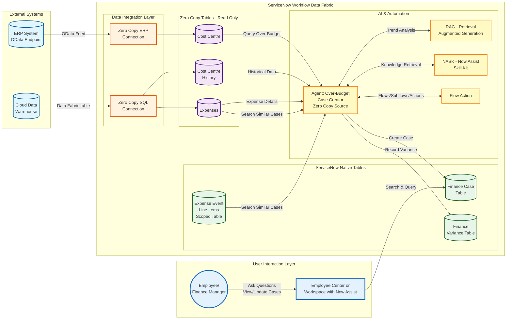

# Lab Exercise: Zero Copy Connectors

[Take me back to ReadMe](./)

This lab will walk you through integration of data coming from Cloud Data Warehouses and ERP using Zero Copy Connectors (ZCC) for SQL and ERP respectively.

### Data flow

The data flow below shows how ServiceNow will consume Cloud Data Warehouse Data Assets and ERP OData Endpoints via ZCC for SQL and ERP respectively. The data taken from the external sources will be used by an agent which is triggered periodcially and will create Finance Cases for Cost Centers which are going overbudget. While majority of the workflow is handled deterministically, AI Agents will provide additional context by searching and comparing expenses and cost center histories to enrich the workflow data that will be used by the personnel in charge of the cost centers.

**Note**: future versions of this lab will include ServiceNow Enterprise Graph which will provide a universal query functionality that brings together the various internal and external data sources. As of Jan-2026, said feature is not globally available and is hence not yet included in this lab.

### Steps

#### Zero Copy for SQL

1.  Test entry&#x20;

    <figure><figcaption></figcaption></figure>
2.  a&#x20;

    <figure><figcaption></figcaption></figure>
3.  a&#x20;

    <figure><figcaption></figcaption></figure>
4.  a&#x20;

    <figure><figcaption></figcaption></figure>
5.  a&#x20;

    <figure><figcaption></figcaption></figure>
6.  a&#x20;

    <figure><figcaption></figcaption></figure>
7.  a&#x20;

    <figure><figcaption></figcaption></figure>
8.  a&#x20;

    <figure><figcaption></figcaption></figure>
9.  a&#x20;

    <figure><figcaption></figcaption></figure>
10. a&#x20;

    <figure><figcaption></figcaption></figure>
11. a&#x20;

    <figure><figcaption></figcaption></figure>
12. a&#x20;

    <figure><figcaption></figcaption></figure>
13. a&#x20;

    <figure><figcaption></figcaption></figure>
14. a&#x20;

    <figure><figcaption></figcaption></figure>
15. a&#x20;

    <figure><figcaption></figcaption></figure>
16. a&#x20;

    <figure><figcaption></figcaption></figure>
17. a&#x20;

    <figure><figcaption></figcaption></figure>
18. a&#x20;

    <figure><figcaption></figcaption></figure>
19. a&#x20;

    <figure><figcaption></figcaption></figure>

[Take me back to ReadMe](./)
