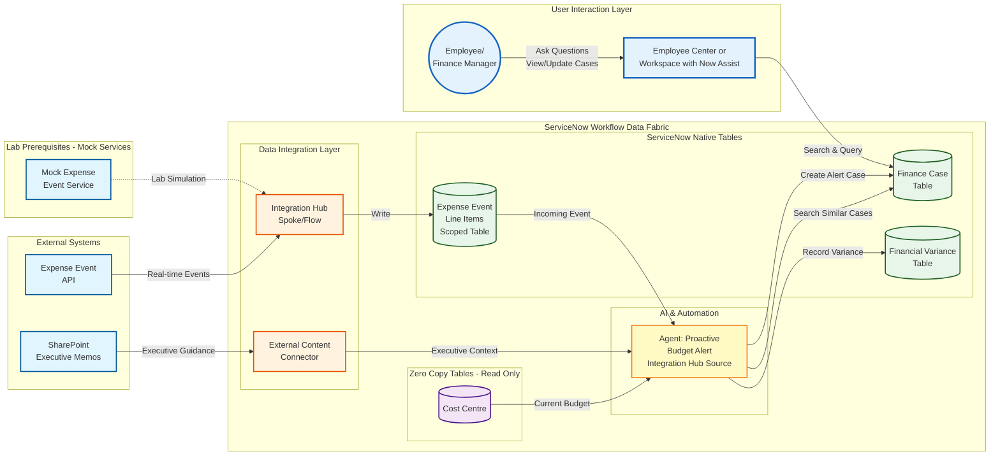

# Lab Exercise: Integration Hub

[Take me back to ReadMe](./)

This lab will walk you through configuration of Spoke actions and Flows to get expense data from an external source periodically or ad hoc and trigger an agent which will evaluate the expense data and create a Finance case if the involved cost center will be over budget.

### Data flow

The data flow below shows how ServiceNow will consume REST API endpoints via Integration Hub Spokes then further processed by a Flow so the entries will be written in the scoped table.

[Take me back to ReadMe](./)
