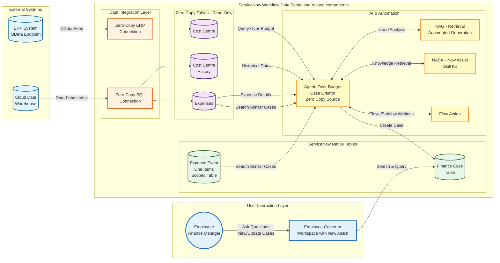

# Lab Exercise: Zero Copy Connectors

[Take me back to ReadMe](./)

This lab will walk you through integration of data coming from Cloud Data Warehouses and ERP using Zero Copy Connectors (ZCC) for SQL and ERP respectively.

## Data flow

The data flow below shows how ServiceNow will consume Cloud Data Warehouse Data Assets and ERP OData Endpoints via ZCC for SQL and ERP respectively. The data taken from the external sources will be used by an agent which is triggered periodcially and will create Finance Cases for Cost Centers which are going overbudget. While majority of the workflow is handled deterministically, AI Agents will provide additional context by searching and comparing expenses and cost center histories to enrich the workflow data that will be used by the personnel in charge of the cost centers.

**Note**: future versions of this lab will include ServiceNow Enterprise Graph which will provide a universal query functionality that brings together the various internal and external data sources. As of Jan-2026, said feature is not globally available and is hence not yet included in this lab.

## Steps

### Zero Copy for ERP

This provides the steps needed to connect ServiceNow to the ERP system to obtain Cost Center Master data.

1. Navigate to All > a.) type **Zero Copy Connector for ERP Home** > b.) click **Zero Copy Connector for ERP Home**.

<figure><figcaption></figcaption></figure>

2\. The \*\*Zero Copy Connector for ERP Home\*\* is a workspace which has the layout as below.

<figure><figcaption></figcaption></figure>

3\. Click on a.) \*\*Models (database icon)\*\* > b.) click \*\*Model Name\*\* > \*\*more (vertical three dots)\*\* > c.) type \*\*DP: Cost Center\*\* > d.) click \*\*Apply\*\*.

<figure><figcaption></figcaption></figure>

4\. Click on \*\*DP: Cost Center\*\*.

<figure><figcaption></figcaption></figure>

5\. Note the a.) popup that indicates that you are opening an \*\*ERP Data Product\*\* which is delivered as templates that customers can use to ramp-up creation of ERP models. Click b.) \*\*Clone\*\* to create a copy of this model.

<figure><figcaption></figcaption></figure>

6\. Provide the label for the cloned model as a.) \*\*SAP Cost Center\*\* and take not of the Target application which should be b.) \*\*Forecast Variance\*\*. Click c.) \*\*Clone this model\*\* once done.

<figure><figcaption></figcaption></figure>

7\. After cloning the model, you will be redirected to the \*\*Models\*\* section. Click \*\*SAP Cost Center\*\* which you have just created as a clone in the previous step.

<figure><figcaption></figcaption></figure>

8\. Click \*\*Manage model\*\*.

<figure><figcaption></figcaption></figure>

9\. Click \*\*Read\*\*.

<figure><figcaption></figcaption></figure>

10\. Notice that there is a BAPI already configured based on the \*\*DP: Cost Center\*\* model you have cloned earlier. The entity \*\*BAPI\\\_CONSTCENTER\\\_GETDETAIL1\*\* is already configured here so you do not have to do anything. As mentioned earlier, there are other ways to obtain master data from SAP (whether it is Cost Center, Materials, etc.) such as RFC table reads or OData endpoints.

<figure><figcaption></figcaption></figure>

11\. Click on \*\*Specify Inputs\*\*. You do not need to do anything in this screen. The intent is to provide an overview of what can be configured as fields for selections when extracting or displaying information from the ERP system. If the table, BAPI, or OData endpoint supports it, this screen can be kept blank which is an equivalent of selecting all entries.

<figure><figcaption></figcaption></figure>

12\. Click on \*\*Choose outputs\*\*. You do not need to do anything in this screen. The intent is to provide an overview of what can be configured as the output for your selection or extraction. Both \*\*Specify inputs\*\* and \*\*Choose outputs\*\* sections can be intimidating for non-SAP practitioners which led to the creation of the \*\*Data Product\*\* which we cloned in \*\*Step 5\*\*. Find out more about \[\*\*ERP Data Products here\*\*]\(https://store.servicenow.com/store/app/9a0ad9f41b19e650396216db234bcba9).

<figure><figcaption></figcaption></figure>

13\. Go to a.) \*\*Extraction tables (Sankey diagram icon)\*\* and click b.) \*\*Name\*\* > \*\*more (vertical three dots)\*\* > c. type \*\*SAP Cost Center\*\* and d.) click \*\*Apply\*\*.

<figure><figcaption></figcaption></figure>

14\. Click on \*\*SAP Cost Center\*\*.

<figure><figcaption></figcaption></figure>

15\. There is a notification stating that <mark style="color:green;">\*\*a.)\*\*</mark> the object is in the \*\*Zero Copy Connector for ERP application\*\*, this is expected. Note that the <mark style="color:green;">\*\*b.)\*\*</mark> ERP model is different from what you have created earlier where it is called \*\*SAP Material Transfer Cost Center\*\*, this is expected. These discrepancies are due to the fact that we are not connected to a live SAP system for this exercise due to various constraints, however all the tools and configurations you have used are representative of integrating with SAP. Finally, <mark style="color:green;">\*\*c.)\*\*</mark> click on the \*\*Target table link\*\* which is \*\*/sn\\\_erp\\\_integration\\\_cost\\\_center\\\_list.do\*\*.

<figure><figcaption></figcaption></figure>

16\. This will lead you to the extraction table which contains Cost Center Master Data from SAP. This exercise uses an extraction scenario where data from SAP is stored in ServiceNow. Online read is also possible with more details found on the blog post \[Zero Copy Connector for ERP guide by Leo Francia in the ServiceNow community]\(https://www.servicenow.com/community/app-engine-for-erp-blogs/part-1-of-4-intelligent-erp-workflows-get-sap-data-into/ba-p/3192800).

<figure><figcaption></figcaption></figure>

17\. Congratulations! You have set-up the integration a Cloud Data Warehouse using Zero Copy Connector for ERP.

### Zero Copy for SQL

This provides the steps needed to connect ServiceNow to the Cloud Data Warehouse and get summary data needed for workflow context and logic.

1. For reference purposes only, the table which will be used as source for Zero Copy for SQL coming from Snowflake is shown below. No action needs to be done for this step.

<figure><figcaption></figcaption></figure>

2\. In the ServiceNow navigation, go to All > a.) type \*\*Workflow Data Fabric Hub\*\* > go to \*\*Workflow Data Fabric Hub\*\*

<figure><figcaption></figcaption></figure>

3\. In the landing page, go to \*\*Established connections\*\* > \*\*Alectri Finance\*\*. <mark style="color:red;">\*\*Note:\*\*</mark> this established connection is configured specifically for instances used in ServiceNow-led labs.

<figure><figcaption></figcaption></figure>

4\. In the \*\*Connection details\*\* tab of the screen that immediately follows, the established connection is configured as shown in the screenshot below. No action needs to be done for this step.

<figure><figcaption></figcaption></figure>

5\. Go to a.) Data assets > b.) click \*\*Create data fabric table\*\*.

<figure><figcaption></figcaption></figure>

6\. Provide the information needed for a.) the label e.g. \*\*Cost Center Budget Summary\*\* and the b.) \*\*Name\*\* which will automatically provided. <mark style="color:red;">\*\*Note:\*\*</mark> keep the name length not more than 35 characters such as what is listed below, e.g. \*\*x\\\_snc\\\_forecast\\\_v\\\_0\\\_df\\\_cc\\\_summary\*\*. Click c.) \*\*Continue\*\* once done.

<figure><figcaption></figcaption></figure>

7\. In the screen that immediate follows, click on the tick box beside \*\*Name\*\* and this will include all the fields from the Snowflake data asset to the data fabric table being configured.

<figure><figcaption></figcaption></figure>

8. Look for **Cost center** column > change the data type from **String** to a.) **Reference** and click b.) **Reference** to set the table from which **Cost center** column will refer to.

<figure><figcaption></figcaption></figure>

9. In the modal pop-up that appears, select the table **sn\_erp\_integration\_cost\_center** which you have set-up in the ZCC for ERP lab exercise.

<figure><figcaption></figcaption></figure>

10. In the same modal pop-up, select **Cost Center**.

<figure><figcaption></figcaption></figure>

11. Once completed, click **Set Reference**.

<figure><figcaption></figcaption></figure>

12. Finally, set GL account as the **Primary** key as shown in the a.) toggle below. Click b.) **Finish** once done.

<figure><figcaption></figcaption></figure>

13. A pop-up dlalog indicating that a primary key has been defined. Click **Confirm**.

<figure><figcaption></figcaption></figure>

14. This will lead you to a screen showing the data assets created.

<figure><figcaption></figcaption></figure>

15. In the saem screen, click on the a.) three vertical dots then b.) **Open list**.

<figure><figcaption></figcaption></figure>

16. This will lead you to the data fabric table. Click on one the company codes such as **SCM-UK-WH**.

<figure><figcaption></figcaption></figure>

17. This will lead you the record in the **SAP Cost Center** table (**sn\_erp\_integration\_cost\_center**) which you have configured in the ZCC for ERP section.

<figure><figcaption></figcaption></figure>

18. Congratulations! You have set-up the integration a Cloud Data Warehouse using Zero Copy Connector for SQL.

### Custom Forecast Variance AI Agent in action

This is a walk through of how the an AI Agent with equipped with both deterministic and probabilistic can automate research and validation of cost center history and expenses as well as creation of Finance Cases should cost centers be above their budget allocations. <mark style="color:red;">**Note:**</mark> this is a custom AI agent pre-configured in the lab instance provided in ServiceNow-led lab sessions; this is not a pre-built agent.

1. Go to All > type **x\_snc\_forecast\_v\_0\_expense\_transaction\_event.list** and hit **Return/Enter ↵**.

<figure><figcaption></figcaption></figure>

2\. This will lead to the screen below. Note that this is the table created in [Lab Exercise: Fundamentals](1_Fundamentals.md) and populated with the data from [Lab Exercise: Integration Hub](2_Integration_Hub.md).

<figure><figcaption></figcaption></figure>

3\. After reviewing the table, navigate to All > <mark style="color:green;">**a.)**</mark> type **AI Agent Studio** > <mark style="color:green;">**b.)**</mark> click on **Create and Manage**.

<figure><figcaption></figcaption></figure>

4\. This will go to the list of workflows and agents. Go to **AI agents**  tab > <mark style="color:green;">**a.)**</mark> click **search (magnifying glass)** > <mark style="color:green;">**b.)**</mark> type **Forecast Variance** and hit **Return/Enter ↵**.

<figure><figcaption></figcaption></figure>

5\. Click on **Forecast Variance**.

<figure><figcaption></figcaption></figure>

6\. Click on **Define the specialty**. This shows all the instructions for this AI Agent created in plain English. The **List of steps** describes the sequence, purpose, and nuances of the tools configured, which are shown in the next section. No action is required in this screen.

<figure><figcaption></figcaption></figure>

7\. In the same screen, scroll down to see additional configurations. No action is required in this screen.

<figure><figcaption></figcaption></figure>

8\. Next, click on **Add tools and information**. This is a collection of **Search retrievals** and **Subflows** that are used by the agent. The purpose and sequence of these tools are also described in the section **Define the specialty**.

<figure><figcaption></figcaption></figure>

9\. Next, click on Define trigger, which is kept blank. You can add the triggers for the AI Agent here but for the exercise, the AI Agent will be triggered manually to be able to show the detail chat responses and debugging.

<figure><figcaption></figcaption></figure>

10\. d

<figure><figcaption></figcaption></figure>

11\. d

<figure><figcaption></figcaption></figure>

12\. d

<figure><figcaption></figcaption></figure>

13\. d

<figure><figcaption></figcaption></figure>

14\. d

<figure><figcaption></figcaption></figure>

15\. d

<figure><figcaption></figcaption></figure>
16. d

<figure><figcaption></figcaption></figure>

[Take me back to ReadMe](./)
