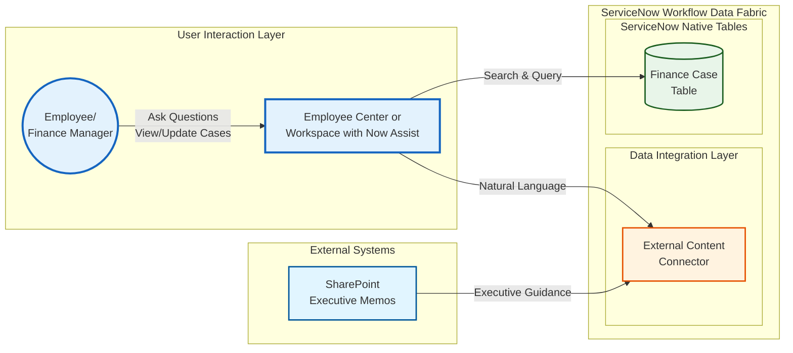

# Lab Exercise: External Content Connector
[Take me back to ReadMe](https://github.com/leojacinto/WorkflowDataFabric/blob/main/ReadMe.md)
Lab Exercise coming soon!
This lab will walk you through configuration of External Content Connectors as a source of unstructured document data to supplement automations needed in Finance case creation.
### Data Flow
The data flow below shows how ServiceNow will infomration from indexed documents from a document repository such as SharePoint to provide additional context and information to assist with Flows and Automations.

[Take me back to ReadMe](https://github.com/leojacinto/WorkflowDataFabric/blob/main/ReadMe.md)
