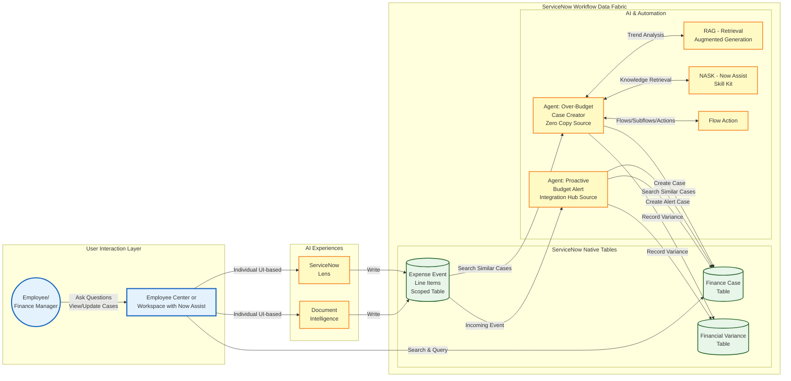

# Lab Exercise: ServiceNow Lens and Document Intelligence

<mark style="color:red;">**Lab Exercise creation in progress!**</mark>

[Take me back to ReadMe](./)

This lab will walk you through the configuration and usage of ServiceNow Lens and Document Intelligence as  sources of unstructured document data for interactive and batch capture of expense information from documents.

### Data flow

The data flow below shows how ServiceNow will get information from documents from invoices and further process said information to evaluate whether a Finance case should be created.

[Take me back to ReadMe](./)
