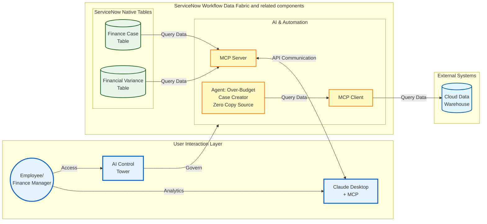

# Lab Exercise: Model Context Protocol Server/Client and AI Control Tower

<mark style="color:red;">**Lab Exercise creation in progress! Content Coming February 2025.**</mark>

[Take me back to main page](./)

This lab will walk you through the configuration and usage of MCP capabilities to interact with ServiceNow either as a client or as a server, allowing end users to interact with the platform as they see fit. As a final step in the series, you will also get a view of how ServiceNow is able to govern AI assets across your landscape using AI Control Tower.

## Data flow

The data flow below shows how ServiceNow provides MCP client and server capabilities as well governance of AI assets.

[Take me back to main page](./)
