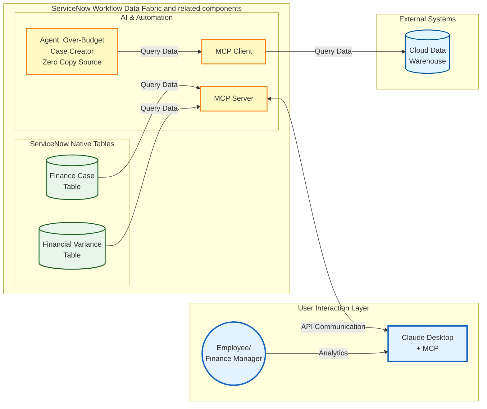

# Lab Exercise: Model Context Protocol Server/Client

[Take me back to main page](./)

This lab will walk you through the configuration and usage of MCP capabilities to interact with ServiceNow either as a client or as a server, allowing end users to interact with the platform as they see fit. For simplicity, this lab will cover ServiceNow acting as an MCP Client. More details on MCP Server scenarios will be added soon.

## Data flow

The data flow below shows how ServiceNow provides MCP client and server capabilities as well governance of AI assets.

## Steps

### Connecting to an MCP Server (Snowflake)

This provides the steps needed to connect ServiceNow to an MCP ([Model Context Protocol](https://modelcontextprotocol.io/docs/getting-started/intro)) Server tool configured in Snowflake. ServiceNow can serve as an MCP Client to connect to any solution that has MCP support.&#x20;

This exercise does not cover the creation of the MCP Service from Snowflake as that requires administrator rights and CDW expertise which may not be widely available to various personas.

1. Navigate to All > <mark style="color:green;">**a.)**</mark> type **AI Agent Studio** > <mark style="color:green;">**b.)**</mark> click on **Create and Manage**.

<figure><figcaption></figcaption></figure>

2. This will go to the list of workflows and agents. Go to **AI agents** tab > <mark style="color:green;">**a.)**</mark> click **search (magnifying glass)** > <mark style="color:green;">**b.)**</mark> type **Forecast Variance** and hit **Return/Enter ↵**.

<figure><figcaption></figcaption></figure>

3. Click on **Forecast Variance**.

<figure><figcaption></figcaption></figure>

4. Click on <mark style="color:$success;">**a.)**</mark> **more (vertical three dots)** > <mark style="color:$success;">**b.) Duplicate**</mark>&#x20;

<figure><figcaption></figcaption></figure>

5. You will get a prompt to confirm whether you want to duplicate the agent. Click **Duplicate**.

<figure><figcaption></figcaption></figure>

6. In the new Agent screen, go to the **AI agent name** and rename it to **Forecast Variance Snowflake MCP**.

<figure><figcaption></figcaption></figure>

7. In the section **Define the role and Required steps** under sub-section **List of steps**, go to step 2 after the paragraph which starts with **Get cost center obtained in...** then add **Also run the MCP tool "Get Details via Snowflake MCP" as a secondary check. Only return one entry (limit = 1). Columns should be \["COST\_CENTER", "ACTUAL\_AMOUNT\_USD", "BASELINE\_AMOUNT\_USD", "VARIANCE", "VARIANCE\_PCT"]**. It should look like the screenshot below.

<figure><figcaption></figcaption></figure>

8. Click **Save and Continue**.

<figure><figcaption></figcaption></figure>

9. Navigate to <mark style="color:green;">**a.)**</mark> **Add tools and information** > <mark style="color:green;">**b.)**</mark> **Add tool** > <mark style="color:green;">**c.)**</mark> > **MCP server tool**.

<figure><figcaption></figcaption></figure>

10. In the pop-up that appears, <mark style="color:green;">**a.)**</mark> click on the **dropdown** > <mark style="color:green;">**b.)**</mark> select **Snowflake MCP**.

<figure><figcaption></figcaption></figure>

11. In the same pop-up screen, select the tool **variance-baseline-search**.

<figure><figcaption></figcaption></figure>

12. Still in the same pop-up screen provide the following details. Screenshot on how the settings should look like immediately follows. You only need to modify three settings and leave the rest as they are.

<mark style="color:green;">**a.)**</mark> **Name**: **Get Details in Snowflake MCP**

<mark style="color:green;">**b.)**</mark> **Tool description**: **query: Get the details via Snowflake MCP using the cost center taken from "Extract Cost Center" step columns: \["COST\_CENTER", "ACTUAL\_AMOUNT\_USD", "BASELINE\_AMOUNT\_USD", "VARIANCE", "VARIANCE\_PCT"] limit: 1**

<mark style="color:green;">**c.)**</mark> **Execution mode**: **Autonomous**&#x20;

<mark style="color:green;">**d.)**</mark>**&#x20;Save**

<figure><figcaption></figcaption></figure>

13. The pop-up will exit and you should get a section on **Model Context Protocol tools** which should look like below.

<figure><figcaption></figcaption></figure>

14. Click **Save and Continue**.

<figure><figcaption></figcaption></figure>

15. Still in the same pop-up screen provide the following details. Screenshot on how the settings should look like immediately follows. You only need to modify three settings and leave the rest as they are.

<mark style="color:green;">**a.)**</mark> **Name**: **Get Details in Snowflake MCP**

<mark style="color:green;">**b.)**</mark> **Tool description**: **query: Get the details via Snowflake MCP using the cost center taken from "Extract Cost Center" step columns: \["COST\_CENTER", "ACTUAL\_AMOUNT\_USD", "BASELINE\_AMOUNT\_USD", "VARIANCE", "VARIANCE\_PCT"] limit: 1**

<mark style="color:green;">**c.)**</mark> **Execution mode**: **Autonomous**&#x20;

<mark style="color:green;">**d.)**</mark>**&#x20;Save**

16. Configure the availability of the AI Agent as this setting might have been reset when it was copied from the original **Forecast Variance AI Agent**. Follow the steps below and refer to the screenshot that immediately follows.

<mark style="color:green;">**a.)**</mark> Go to **Toggle display**

<mark style="color:green;">**b.)**</mark> Toggle Status to **On**

<mark style="color:green;">**c.)**</mark> Toggle **Now Assist panel** to **On**&#x20;

<mark style="color:green;">**d.)**</mark> Toggle **Virtual Agent** to **On** and select **Now Asssit in Virtual Agent (default)**

<mark style="color:green;">**e.)**</mark> Click **Save and Test**

<figure><figcaption></figcaption></figure>

17. You will be directed to the Test AI reasoning tab. To proceed with testing, <mark style="color:green;">**a.)**</mark> type **Help me process EXP-2025-IT-002-1007-01** and <mark style="color:green;">**b.)**</mark> click **Start test**.

<figure><figcaption></figcaption></figure>

18. The test will run for a few seconds and will show you that it is running the tool **Get Details in Snowflake MCP**. This is the additional tool you created earlier.

<figure><figcaption></figcaption></figure>

19. Finally, you will notice that the **Get Details in Snowflake MCP**&#x20;

<figure><figcaption></figcaption></figure>

20. **Challenge:** once you are done with this lab, see if you can remove the tool Extract Cost Center and replace it completely with the data from **Get Details via Snowflake MCP** as seen in step 7. No hints this time. 😉

## Conclusion

Congratulations! You have created the **MCP Server** integrations that allows ServiceNow to make use of MCP capabilities from other systems outside ServiceNow, allowing LLM-powered integrations alternative APIs ,that require less development.&#x20;

## Next step

You can explore a bonus use case that makes use of Stream Connect for Apache Kafka for integrations that require more throughput and data volume.

[Take me back to main page](./)
