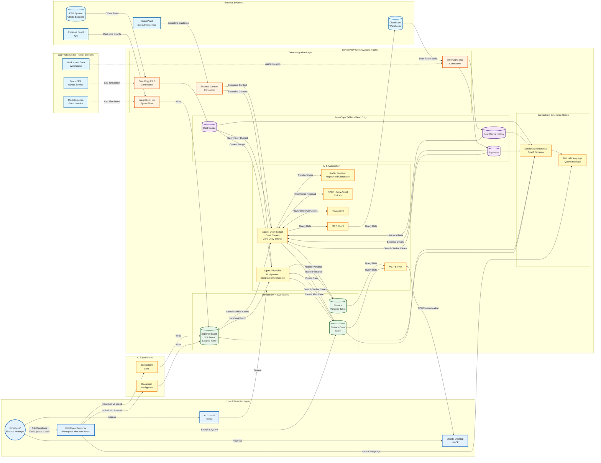

# Data and Flow Diagrams
### Main

```mermaid
graph LR
    subgraph "User Interaction Layer"
        Employee((Employee/<br/>Finance Manager))
        EC[Employee Center or<br/>Workspace with Now Assist]
        ClaudeDesktop[Claude Desktop<br/>+ MCP]
        ControlTower[AI Control<br/>Tower]
    end

    subgraph "External Systems"
        ERP[(ERP System<br/>OData Endpoint)]
        ExpenseAPI[Expense Event<br/>API]
        SharePoint[SharePoint<br/>Executive Memos]
        CDW[(Cloud Data<br/>Warehouse)]
    end

    subgraph "AI Experiences"
        Lens["ServiceNow</br>Lens"]
        DocIntel["Document</br>Intelligence"]
    end

    subgraph "ServiceNow Workflow Data Fabric"
        subgraph "Data Integration Layer"
            ZeroCopySQL[Zero Copy SQL<br/>Connection]
            ZeroCopyERP[Zero Copy ERP<br/>Connection]
            IntHub[Integration Hub<br/>Spoke/Flow]
            ExtContent[External Content<br/>Connector]
        end

        subgraph "Zero Copy Tables - Read Only"
            ZCCC[(Cost Centre)]
            ZCCH[(Cost Centre History)]
            ZCExp[(Expenses)]
        end

        subgraph "ServiceNow Native Tables"
            ExpenseTable[(Expense Event<br/>Line Items<br/>Scoped Table)]
            FinCase[(Finance Case<br/>Table)]
            FinVar[(Finance<br/>Variance Table)]
        end

        subgraph "ServiceNow Enterprise Graph"
            GGraph[ServicNow Enterprise<br/> Graph Schema]
            NLQuery[Natural Language<br/>Query Interface]
        end

        subgraph AI[AI & Automation]
            Agent1[Agent: Over-Budget<br/>Case Creator<br/>Zero Copy Source]
            Agent2[Agent: Proactive<br/>Budget Alert<br/>Integration Hub Source]
            RAG[RAG - Retrieval<br/>Augmented Generation]
            NASK[NASK - Now Assist<br/>Skill Kit]
            FlowAction[Flow Action]
            MCPS[MCP Server]
            MCPC[MCP Client]
        end
    end

    subgraph "Lab Prerequisites - Mock Services"
        MockERP[Mock ERP<br/>OData Service]
        MockExpense[Mock Expense<br/>Event Service]
        MockCDW[Mock Cloud Data<br/>Warehouse]
    end

    %% Data Flow Connections
    ERP -->|OData Feed| ZeroCopyERP
    CDW -->|Data Fabric table| ZeroCopySQL
    MockERP -.->|Lab Simulation| ZeroCopyERP
    MockCDW -.->|Lab Simulation| ZeroCopySQL
    ZeroCopyERP --> ZCCC
    ZeroCopySQL --> ZCCH
    ZeroCopySQL --> ZCExp
    ExpenseAPI -->|Real-time Events| IntHub
    MockExpense -.->|Lab Simulation| IntHub
    IntHub -->|Write| ExpenseTable
    EC -->|Individual UI-based| Lens -->|Write| ExpenseTable
    EC -->|Individual UI-based| DocIntel -->|Write| ExpenseTable
    SharePoint -->|Executive Guidance| ExtContent

    %% ServiceNow Enterprise Connections
    ZCCC --> GGraph
    ZCCH --> GGraph
    ZCExp --> GGraph
    ExpenseTable --> GGraph
    FinCase --> GGraph
    GGraph --> NLQuery

    %% Agent 1 Workflow - Zero Copy Source
    ZCCC -->|Query Over-Budget| Agent1
    ZCCH -->|Historical Data| Agent1
    ZCExp -->|Expense Details| Agent1
    ExpenseTable -->|Search Similar Cases| Agent1
    ZCExp -->|Search Similar Cases| Agent1
    ExtContent -->|Executive Context| Agent1
    Agent1 -->|Create Case| FinCase
    Agent1 <-->|Trend Analysis| RAG
    Agent1 <-->|Knowledge Retrieval| NASK
    Agent1 <-->|Flows/Subflows/Actions| FlowAction
    Agent1 -->|Record Variance| FinVar

    %% Agent 2 Workflow - Integration Hub Source
    ExpenseTable -->|Incoming Event| Agent2
    ZCCC -->|Current Budget| Agent2
    Agent2 -->|Search Similar Cases| FinCase
    ExtContent -->|Executive Context| Agent2
    Agent2 -->|Create Alert Case| FinCase
    Agent2 -->|Record Variance| FinVar

    %% MCP Server Connection
    FinVar -->|Query Data| MCPS
    FinCase -->|Query Data| MCPS
    MCPS <-->|API Communication| ClaudeDesktop

    %% MCP Client Connection
    Agent1 -->|Query Data| MCPC
    MCPC -->|Query Data| CDW

    %% User Interaction Connections
    Employee -->|Ask Questions<br/>View/Update Cases| EC
    EC -->|Search & Query| FinCase
    EC -->|Natural Language| NLQuery
    Employee -->|Access| ControlTower -->|Govern| AI
    Employee -->|Analytics| ClaudeDesktop

    %% Styling
    classDef external fill:#e1f5ff,stroke:#01579b,stroke-width:2px
    classDef integration fill:#fff3e0,stroke:#e65100,stroke-width:2px
    classDef zeroCopy fill:#f3e5f5,stroke:#4a148c,stroke-width:2px
    classDef native fill:#e8f5e9,stroke:#1b5e20,stroke-width:2px
    classDef ai fill:#fff9c4,stroke:#f57f17,stroke-width:2px
    classDef user fill:#e3f2fd,stroke:#1565c0,stroke-width:3px

    class ERP,ExpenseAPI,SharePoint,CDW,MockERP,MockExpense,MockCDW external
    class ZeroCopySQL,ZeroCopyERP,IntHub,ExtContent integration
    class ZCCC,ZCCH,ZCExp zeroCopy
    class ExpenseTable,FinCase,FinVar native
    class Agent1,Agent2,RAG,NASK,FlowAction,MCPS,MCPC,GGraph,NLQuery,Lens,DocIntel ai
    class Employee,EC,ControlTower,ClaudeDesktop user
```
