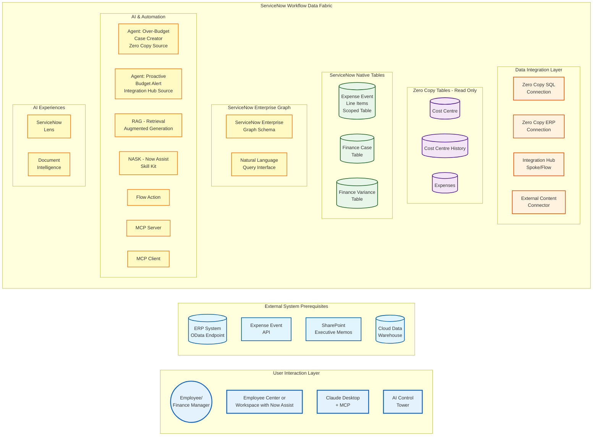

# Data and Flow Diagrams

### Components
Let us first start by breaking down the different components of the lab. In a tightly integrated ServiceNow landscape that spans various internal ServiceNow components and external data sources, the diagram below would be a good represenation. These internal and external components will be used by Flows and AI Agents to provide the automations needed to solve our business problem of managing financial budgets. While the components will look overwhelming, the reality is customer landscapes require this level of complexity to manage different types of data across multiple functions. The key thing to note is  end user will interact with **Employee Center**, an **MCP Client** (e.g., Claude Code or Desktop), or in slightly more technical scenarios **AI Control Tower**. 

### External System Prerequisites
Baseline configuration for the external systems listed in this lab are done prior to the steps listed. As mentioned in the disclaimer, environments which will have the prereqiusite external systems will be available externally for customers soon and for time being, you can use this lab as a guide on how the components will interact. 

* **ERP**: This lab will use an SAP system with OData endpoints. The OData authentication and integration is already configured in this execrcise and the objective is get the needed endpoint by selecting it from the OData catalog. If you wish to learn more on how to create the configuration in your own environment, check this [Zero Copy Connector for ERP guide from Leo Francia in the ServiceNow community](https://www.servicenow.com/community/app-engine-for-erp-blogs/part-1-of-4-intelligent-erp-workflows-get-sap-data-into/ba-p/3192800). You can also take this ServiceNow University course on [Introduction to Zero Copy Connector for ERP Data Products and Process Extensions](https://learning.servicenow.com/lxp/en/app-engine/introduction-to-zero-copy-connector-for-erp-data-products-and?id=learning_course_prev&course_id=72e3387d937bea54fb94b4886cba1095).
* **Cloud Data Warehouse**: Snowflake will be the cloud data warehouse used in this lab. If you have a Databricks or Redshift environment, the principles and steps here will also apply. The Snowflake key-pair authentication and integration is already configured in this execrcise and the objective is get the needed data asset by selecting it from Workflow Data Fabric Hub. If you wish to learn more on how to create the configuration in your own environment, check this ServiceNow University course on [Zero Copy Connector Basics](https://learning.servicenow.com/lxp/en/automation-engine/zero-copy-connector-basics?id=learning_course_prev&course_id=c505959493283e903cc0322d6cba1025).
* **Document Storage**: SharePoint will be used as the document storage which will be the target of External Content Connectors or XCC. Unstructured data will be stored in SharePoint which will be indexed by ServiceNow as additional source of data for Flows and AI Agents in this lab exercise. If you wish to learn more on how to create the configuration in your own environment, check this ServiceNow University course on [Introduction to AI Search and External Content Connectors](https://learning.servicenow.com/lxp/en/now-platform/introduction-to-ai-search-and-external-content-connectors?id=learning_course_prev&course_id=62283c7c93d46e50f2d9bc686cba107b).

### Overall Data Flow
Do not let the graph below intimidate you 😉. This will be broken down further and the intent of showing the whole data flow is to provide an overview of the inner workings within ServiceNow while, as mentioned earlier, the end user will interact with **Employee Center**, an **MCP Client** (e.g., Claude Code or Desktop), or in slightly more technical scenarios **AI Control Tower**. 

You can skip the review of the diagram below if you prefer and head straight into the lab exercises if you so desire.

